# bsc-sdd — high-level design

> The reviewed, human-level picture of the system. One diagram, one
> regeneration prompt, one machine-readable flow table. **High level only** —
> the live, always-current step-level graph is on the board (front page,
> expand any workflow); per-feature WHAT/HOW projections are generated into
> `run/docs/<feature>/`. This file is for review, onboarding, and as seed
> data for future design tasks.

## The system in one sentence

A requirement goes in; a **spec** (contracts + behavior assertions with
stable IDs) is negotiated with a human at real forks; **BiSheng C code** is
generated function-by-function against a frozen interface; everything is
verified by a three-tier model — **compiler (sound) → tests (sound per
case) → LLM (argued residual)** — with full requirement-to-code
traceability, and every artifact (docs, verdicts, bodies) is a projection
of one database.

## Flow (high level)

```mermaid
flowchart LR
  classDef human  fill:#f5e6bf,stroke:#9a6700,color:#5c4a00;
  classDef model  fill:#e6dcfa,stroke:#7c3aed,color:#3c1d8f;
  classDef mech   fill:#e8eaed,stroke:#5c6773,color:#1f262e;
  classDef data   fill:#dff0e4,stroke:#1a7f37,color:#0f4c22;

  REQ[/"requirement.md<br/>(+ smoke.cbs, testing.md)"/]:::data

  subgraph PLAN ["plan — requirement → verified spec"]
    DECOMP["decompose to R-items"]:::model
    FID{"fidelity gate<br/>raw ↔ R-items"}:::model
    BRIEF["design options<br/>(or SKIP)"]:::model
    DGATE{{"HUMAN:<br/>design gate"}}:::human
    WSPEC["write spec IR<br/>contracts + assertions"]:::model
    VAL{"coverage +<br/>qualifier-join check"}:::mech
  end

  subgraph CODEGEN ["code_gen — spec → verified BSC"]
    TDD["behavior tests first<br/>(optional TDD)"]:::model
    GEN["per-function codegen<br/>against frozen skeleton"]:::model
    COMP{"BSC compiler<br/>SOUND gate"}:::mech
    RUNT{"smoke + TDD suites<br/>sound per case"}:::mech
    BEH["LLM behavior check<br/>(argued residual)"]:::model
    CONF["conformance<br/>impl → every R-item"]:::model
  end

  subgraph EDIT ["fn_edit — change one function"]
    FEDIT["edit against frozen<br/>interface"]:::model
    IGATE{{"HUMAN:<br/>interface gate"}}:::human
  end

  DB[("pipeline DB<br/>single source of truth")]:::data
  DOCS[/"spec.md (WHAT)<br/>design.md (HOW)"/]:::data
  BOARD[["board: runs · decisions ·<br/>audit · entity views"]]:::data

  REQ --> DECOMP --> FID --> BRIEF --> DGATE --> WSPEC --> VAL
  FID -. FAIL: re-decompose .-> DECOMP
  DGATE -. reject all + message .-> BRIEF
  VAL -- "spec.validated" --> TDD --> GEN --> COMP --> RUNT --> BEH --> CONF
  COMP -. red: regenerate (capped) .-> GEN
  BOARD -- "change this function" --> FEDIT --> COMP
  FEDIT -- "needs interface change" --> IGATE
  IGATE -- "picked: full revision" --> DECOMP
  VAL --> DOCS
  CONF --> DOCS
  PLAN <--> DB
  CODEGEN <--> DB
  DB --> BOARD
```



Legend (matches the board): **amber = human decides**, **violet = model
works**, **steel = deterministic machinery**, **green = data/artifacts**.

## Diagram prompt (Lucidchart / draw.io / any AI diagram tool)

Paste this to regenerate or restyle the picture:

> Draw a left-to-right flowchart of a spec-driven code-generation pipeline
> with three swimlane containers and four standalone shapes.
> Container "plan (requirement → verified spec)" contains, in order:
> "decompose to R-items" (violet, model), "fidelity gate" (violet diamond),
> "design options" (violet), "HUMAN design gate" (amber hexagon), "write
> spec IR" (violet), "coverage + qualifier-join check" (steel diamond).
> Container "code_gen (spec → verified BSC)" contains: "behavior tests
> first (optional TDD)" (violet), "per-function codegen against frozen
> skeleton" (violet), "BSC compiler SOUND gate" (steel diamond), "smoke +
> TDD suites" (steel diamond), "LLM behavior check" (violet), "conformance
> impl→R-items" (violet). Container "fn_edit (change one function)"
> contains: "edit against frozen interface" (violet) and "HUMAN interface
> gate" (amber hexagon). Standalone: "requirement.md + smoke.cbs +
> testing.md" (green document, far left), "pipeline DB — single source of
> truth" (green cylinder, bottom center), "spec.md + design.md" (green
> documents, right), "board" (green UI shape, bottom right).
> Solid arrows: requirement → decompose → fidelity → options → design gate
> → write spec → checks; checks —"spec.validated"→ TDD → codegen → compiler
> → suites → behavior → conformance; conformance → docs; board —"change
> this function"→ edit → compiler; edit —"needs interface change"→
> interface gate —"picked"→ decompose. Dashed loop-backs: fidelity FAIL →
> decompose; design-gate "reject all + message" → options; compiler red →
> codegen (capped). Both big containers connect bidirectionally to the DB;
> DB → board. Color rule: amber = human decision, violet = LLM work,
> steel = deterministic machinery, green = data.

## Flow data (machine-readable — for review & future tasks)

```yaml
actors: {human: amber, model: violet, machinery: steel, data: green}
nodes:
  - {id: requirement, actor: data,      in: project-folder}
  - {id: decompose,   actor: model,     wf: plan}
  - {id: fidelity,    actor: model,     wf: plan, gate: true}
  - {id: options,     actor: model,     wf: plan}
  - {id: design_gate, actor: human,     wf: plan, gate: true}
  - {id: write_spec,  actor: model,     wf: plan}
  - {id: validate,    actor: machinery, wf: plan, gate: true}
  - {id: tdd,         actor: model,     wf: code_gen, optional: true}
  - {id: codegen,     actor: model,     wf: code_gen}
  - {id: compiler,    actor: machinery, wf: code_gen, gate: true, sound: true}
  - {id: suites,      actor: machinery, wf: code_gen, gate: true, sound: true}
  - {id: behavior,    actor: model,     wf: code_gen, sound: false}
  - {id: conformance, actor: model,     wf: code_gen, sound: false}
  - {id: fn_edit,     actor: model,     wf: fn_edit}
  - {id: iface_gate,  actor: human,     wf: fn_edit, gate: true}
  - {id: db,          actor: data}
  - {id: docs,        actor: data}
  - {id: board,       actor: data}
edges:
  - [requirement, decompose]
  - [decompose, fidelity]
  - [fidelity, options]
  - {from: fidelity, to: decompose, kind: loop, on: FAIL}
  - [options, design_gate]
  - {from: design_gate, to: options, kind: loop, on: reject-all+message}
  - [design_gate, write_spec]
  - [write_spec, validate]
  - {from: validate, to: tdd, event: spec.validated}
  - [tdd, codegen]
  - [codegen, compiler]
  - {from: compiler, to: codegen, kind: loop, on: red, capped: true}
  - [compiler, suites]
  - [suites, behavior]
  - [behavior, conformance]
  - [conformance, docs]
  - [validate, docs]
  - {from: board, to: fn_edit, on: change-this-function}
  - [fn_edit, compiler]
  - {from: fn_edit, to: iface_gate, on: needs-interface-change}
  - {from: iface_gate, to: decompose, on: picked, event: spec.requested}
```

## Where the detail lives

| level | where | freshness |
|---|---|---|
| this file | high-level, reviewed by humans | update on architecture change |
| step-level graph | board front page (derived from workflow defs) | always current |
| per-feature WHAT/HOW | `run/docs/<feature>/spec.md`, `design.md` | regenerated each milestone |
| ground truth | `run/state/forgeflow.db` + `workflows/*.yaml` | is the system |

## Flow (plain text — renders anywhere)

```
            requirement.md   (+ smoke.cbs, optional testing.md)
                  │
┌─────────────────▼──────────────────────────────────────────────────┐
│ 1 · plan                              requirement → verified spec  │
│                                                                    │
│      decompose to R-items ◀─────────────┐                          │
│                  │                      │ FAIL                     │
│                  ▼                      │                          │
│      fidelity gate (raw ↔ R-items) ─────┘                          │
│                  │ PASS                                            │
│                  ▼                                                 │
│      design options (2-4, or SKIP) ◀────┐                          │
│                  │                      │ reject all + message     │
│                  ▼                      │                          │
│   ██ HUMAN: design gate ████████████████┘                          │
│                  │ picked                                          │
│                  ▼                                                 │
│      write spec  (contracts + assertions, traced to R-items)       │
│                  │                                                 │
│                  ▼                                                 │
│      coverage + qualifier-join checks (deterministic)              │
│                  │                                                 │
│                  ▼                                                 │
│      spec.md (WHAT) + design.md (HOW) generated HERE               │
└──────────────────│─────────────────────────────────────────────────┘
                   │  spec.validated
┌──────────────────▼─────────────────────────────────────────────────┐
│ 2 · code_gen                              spec → verified code     │
│                                                                    │
│      freeze module interface (skeleton, once)                      │
│                  │                                                 │
│                  ▼                                                 │
│      behavior tests from the spec (OPTIONAL TDD, no body exists)   │
│                  │                                                 │
│                  ▼                                                 │
│      one function at a time:  generate ──▶ BSC compile (SOUND)     │
│                                   ▲              │                 │
│                                   └── red, capped┘ green           │
│                  │ all green                                       │
│                  ▼                                                 │
│      run smoke + TDD suites  (sound per case)                      │
│                  ▼                                                 │
│      LLM: behavior assertions hold?   (argued)                     │
│                  ▼                                                 │
│      LLM: every R-item fulfilled?     (argued, per-requirement)    │
└──────────────────│─────────────────────────────────────────────────┘
                   ▼
      spec.md / design.md REFRESHED with the full verification trail

┌────────────────────────────────────────────────────────────────────┐
│ 3 · fn_edit — "change this function" (from the board, any time)    │
│                                                                    │
│      edit against the FROZEN interface                             │
│         │ fits              │ needs interface change               │
│         ▼                   ▼                                      │
│      compile + smoke     ██ HUMAN: run full revision? ██           │
│      only, done              │ picked                              │
│                              └────▶  back to plan · decompose      │
│                                      (only the delta re-runs)      │
└────────────────────────────────────────────────────────────────────┘
```

## 流程图（中文 · 纯文本）

```
            需求文档 requirement.md （+ 冒烟测试 smoke.cbs，可选 testing.md）
                  │
┌─ 1 · 规划 plan ── 需求 → 已验证的规格 ──────────
│
│      需求拆解为 R-条目（原子化、稳定编号） ◀────┐
│                  │                             │ 不通过
│                  ▼                             │
│      忠实性门：R-条目 ↔ 原文一致？ ────────────┘
│                  │ 通过
│                  ▼
│      设计方案（2–4 个，无真分叉则跳过） ◀──────┐
│                  │                             │ 全部驳回 + 留言
│                  ▼                             │
│   ██ 人工：设计决策门 ██───────────────────────┘
│                  │ 选定
│                  ▼
│      撰写规格（契约 + 行为断言，逐条追溯 R-条目）
│                  ▼
│      覆盖率 + 限定符衔接检查（确定性，机器）
│                  ▼
│      在此生成 spec.md（做什么）+ design.md（怎么做）
└──────────────────│──────────────────────────────
                   │  spec.validated（规格已验证）
┌─ 2 · 代码生成 code_gen ── 规格 → 已验证的代码 ──
│
│      冻结模块接口（骨架，一次性）
│                  ▼
│      按规格先写行为测试（可选 TDD——此时尚无任何实现）
│                  ▼
│      逐函数：生成 ──▶ BSC 编译（可靠门 · 所有权/空值/借用）
│                ▲            │
│                └─ 红：重生成（有上限）│ 绿
│                  │ 全部通过
│                  ▼
│      运行冒烟 + TDD 测试（逐用例可靠）
│                  ▼
│      LLM：行为断言是否成立？（论证性）
│                  ▼
│      LLM：每条 R-条目是否被代码满足？（论证性，逐需求）
└──────────────────│──────────────────────────────
                   ▼
      spec.md / design.md 刷新：补上完整验证轨迹

┌─ 3 · 函数修改 fn_edit ──（随时从看板对任一函数发起）──
│
│      在【冻结接口】内修改
│         │ 接口可容纳          │ 需要改接口
│         ▼                     ▼
│      仅编译 + 冒烟，完成   ██ 人工：是否走完整流程？██
│                               │ 确认
│                               └────▶ 回到 规划 · 需求拆解
│                                      （只重跑真正变化的部分）
└─────────────────────────────────────────────────
```
